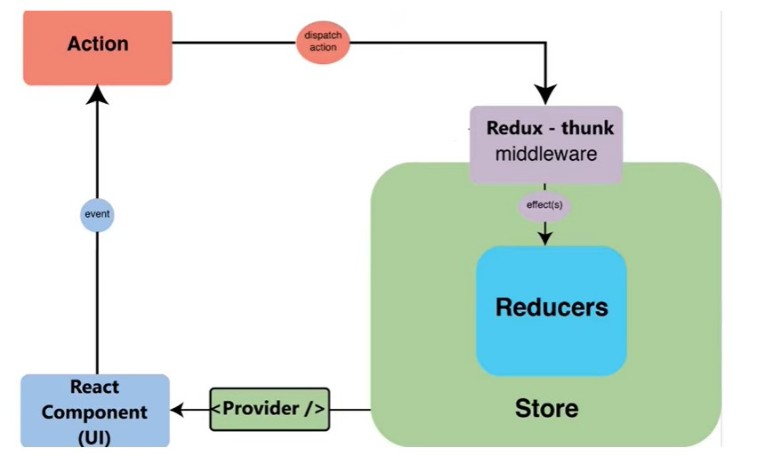

## **Redux is an open source JavaScript library for managing application state**

## Packages required to use redux:

1.  npm install redux
2.  npm install react-redux
3.  npm install redux-thunk
4.  npm install redux-devtools-extension

_Redux thunk is a middleware. It is used to dispatch actions to the reducers in the store._

## Major terms in Redux

1.  Store
    : for storing state values.
2.  Reducer
    : It is a part of a store. Whenever we create a store, we declare a reducer in it. It is used for properly managing and handling the state values stored in the store.
3.  Actions
    : Actions are dispatched to the reducer and it updates the state accondingly.

    Action has 2 things:

    - type: type of value to be changed(think of it as an object or a variable).
    - payload: amount of data to be changed.

    
