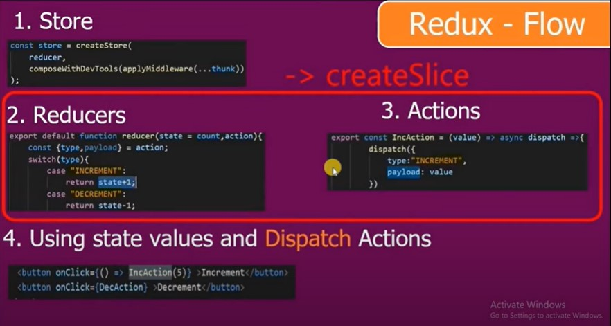
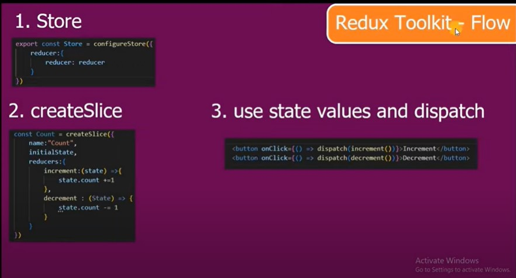

## Redux Toolkit

Redux toolkit is launched by Redux team, to solve three major issues with redux.

1. Configuring a Redux store is too complicated.
2. It requires lot of packeges to build a large scale application.
3. To reduce the complexity of boilerplate code.

## Redux flow

## Redux toolkit flow

## Packages required to use redux-toolkit

- npm install @reduxjs/toolkit react-redux

## To use bootstrap in the project

- npm install bootstrap
